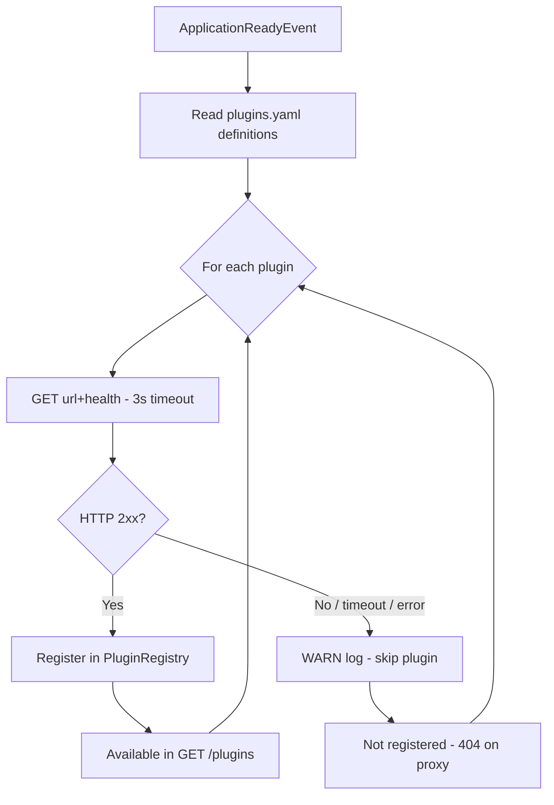
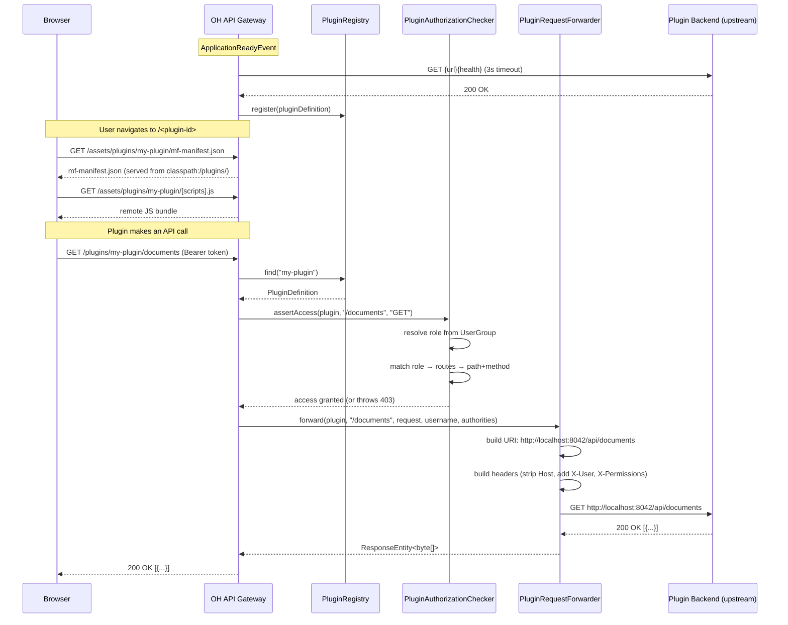

# Plugin Gateway

The Open Hospital API includes a built-in reverse-proxy gateway that discovers, health-checks, and securely proxies requests to external plugin services. This document is the reference for configuring the gateway and understanding how it integrates with the frontend host application.

---

## Table of Contents

1. [Overview](#overview)
2. [Configuration — `plugins.yaml`](#configuration--pluginsyaml)
3. [Authorization Model](#authorization-model)
4. [Identity Headers](#identity-headers)
5. [Health Checks](#health-checks)
6. [API Endpoints](#api-endpoints)
7. [Serving MFE Assets](#serving-mfe-assets)
8. [Architecture & Request Flow](#architecture--request-flow)
9. [Adding a New Plugin](#adding-a-new-plugin)

---

## Overview

Each plugin consists of two parts:

- **A backend service** — a standalone HTTP service (e.g. Spring Boot) that the gateway proxies requests to.
- **A frontend micro-frontend (MFE)** — a Module Federation remote built with Vite, whose static assets are served directly by the OH API.

The gateway sits between the browser and the plugin backend:

```
Browser → OH API /plugins/{id}/{*path} → Plugin backend service
Browser → OH API /assets/plugins/{id}/** → Plugin MFE static files
```

The browser never communicates directly with a plugin backend. All requests are authenticated, authorized, and forwarded by the gateway.

---

## Configuration — `plugins.yaml`

Plugins are defined in `rsc/plugins.yaml`, imported automatically by Spring Boot at startup.

### Full field reference

```yaml
plugins:
  definitions:
    - id: my-plugin           # (string, required)
                              # Unique identifier. Used as:
                              #   • URL path segment:  /plugins/my-plugin/**
                              #   • MFE asset path:    /assets/plugins/my-plugin/**
                              #   • MF remote name in the frontend

      url: http://localhost:8042/api
                              # (string, required)
                              # Base URL of the plugin's backend service.
                              # No trailing slash. All proxied requests are
                              # forwarded to: {url}{subPath}

      health: /actuator/health
                              # (string, required)
                              # Health-check path relative to `url`.
                              # Probed once at startup with a 3-second timeout.
                              # Must return HTTP 2xx for the plugin to be registered.

      configuration:
        bundle:
          label: My Plugin    # (string, required)
                              # Display name shown in the OH frontend nav menu.

          manifest: mf-manifest.json
                              # (string, required)
                              # Filename of the MF manifest inside the plugin's
                              # asset directory. Resolved to:
                              # /assets/plugins/{id}/{manifest}

          type: module        # (string, required)
                              # Module type of the remote entry. Always "module"
                              # for Vite-built MF remotes.

          location: main      # (string, required)
                              # Where the plugin renders in the UI.
                              # Allowed values:
                              #   main    — top-level route  /<plugin-id>
                              #   patient — patient details tab

          styles: assets/style.css
                              # (string, optional)
                              # Relative path to the plugin's CSS file inside
                              # its asset directory. Injected by the frontend
                              # into a <style> tag before the plugin mounts.

        permissions:          # (list, optional)
                              # Role-based access control. If absent or empty,
                              # any authenticated user may access all routes.
                              # DENY BY DEFAULT — if present, only explicitly
                              # listed role+route+method combinations are allowed.

          - role: admin       # (string, required)
                              # Matches the UserGroup code of the authenticated user.

            routes:           # (list, optional)
                              # If empty, this role has no access to any route.

              - path: /documents
                              # (string, required)
                              # Prefix match. Grants access to:
                              #   /documents
                              #   /documents/123
                              #   /documents/123/attachments
                              # Does NOT match /documents-other (must be exact or sub-path).

                methods: [GET, POST, DELETE]
                              # (list, optional)
                              # HTTP methods allowed on this path.
                              # Case-insensitive. If empty, no methods are allowed.

          - role: doctor
            routes:
              - path: /documents
                methods: [GET]
```

## Authorization Model

### Principals

Authorization is **role-based** using the authenticated user's `UserGroup` code (resolved at request time via `UserBrowsingManager`). Each user belongs to exactly one group.

### Algorithm

```
For every request to /plugins/{id}/{subPath}:

1. Resolve plugin from registry by id → 404 if not found
2. Require authenticated principal → 401/500 if missing
3. Resolve role from UserGroup → 403 if not resolvable
4. If plugin has no permissions configured → ALLOW (any authenticated user)
5. Filter permissions entries matching the user's role
6. If no matching role entries → DENY
7. For each matching role entry, check all routes:
     pathMatches  = subPath == route.path  OR  subPath.startsWith(route.path + "/")
     methodMatches = request method in route.methods (case-insensitive)
8. If any route entry satisfies both → ALLOW
9. Otherwise → DENY (403)
```

### Key properties

- **Deny by default** — if the `permissions` list is present but contains no entry granting access, the request is denied.
- **Prefix matching** — `/documents` grants access to `/documents`, `/documents/123`, and `/documents/123/attachments` but NOT `/documents-other`.
- **OR across groups** — if a user's role appears in multiple permission entries (unusual but valid), access is granted if any one entry matches.
- **No unauthenticated access** — all plugin endpoints require a valid JWT Bearer token.

### Example authorization matrix

Given the configuration in the [example above](#example-same-plugin-in-both-locations):

| User role | Path | Method | Result |
|---|---|---|---|
| `admin` | `/documents` | `GET` | ✅ allowed |
| `admin` | `/documents/42` | `DELETE` | ✅ allowed |
| `doctor` | `/documents` | `GET` | ✅ allowed |
| `doctor` | `/documents/42` | `POST` | ❌ denied (method not in list) |
| `doctor` | `/documents/42` | `DELETE` | ❌ denied |
| `nurse` | `/documents` | `GET` | ❌ denied (role not configured) |
| `admin` | `/reports` | `GET` | ❌ denied (path not in routes) |

---

## Identity Headers

The gateway forwards the following headers to the upstream plugin backend on every request:

| Header | Value | Notes |
|---|---|---|
| `X-User` | Authenticated OH username | Always set |
| `X-Permissions` | Comma-separated granted authorities | Always set |
| `Authorization` | `Bearer <JWT>` | Forwarded from the original request |

All other request headers are forwarded as-is, **except `Host`** which is stripped (the upstream receives its own host).

Your plugin backend can trust these headers for identity purposes — the gateway has already validated the JWT before forwarding.

> **Important:** Never expose your plugin backend directly to the internet. It is designed to receive requests only from the OH API gateway, and relies on the forwarded `X-User`/`X-Permissions` headers for identity.

---

## Health Checks

On every `ApplicationReadyEvent` (after Spring Boot fully starts):

1. The gateway reads all `PluginDefinition` entries from `plugins.yaml`.
2. For each plugin it sends `GET {url}{health}` with a **3-second timeout**.
3. If the response is HTTP 2xx → plugin is registered and available.
4. If the response is non-2xx, a timeout, or a connection error → plugin is **skipped** with a `WARN` log. The application continues normally.
5. Skipped plugins do not appear in `GET /plugins` and their routes return 404.



**To re-enable a plugin** after its backend becomes reachable: **restart the OH API**. There is no live re-registration mechanism.

---

## API Endpoints

All endpoints require a valid `Authorization: Bearer <token>` header.

### `GET /plugins`

Returns all plugins that passed the startup health check.

**Response `200 OK`:**
```json
[
  {
    "id": "smart-doc",
    "url": "http://localhost:8042/api",
    "health": "/actuator/health",
    "configuration": {
      "bundle": {
        "label": "Smart Doc",
        "manifest": "mf-manifest.json",
        "type": "module",
        "location": "main",
        "styles": "assets/style.css"
      },
      "permissions": [
        {
          "role": "admin",
          "routes": [
            { "path": "/documents", "methods": ["GET", "POST", "DELETE"] }
          ]
        }
      ]
    }
  }
]
```

The frontend host calls this endpoint at application startup to build the MF remote registry and inject routes.

---

### `ANY /plugins/{id}/{path}`

Proxies a request to the upstream plugin backend after authorization.

**Path parameters:**

| Parameter | Description |
|---|---|
| `id` | Plugin identifier, must match a registered plugin |
| `path` | Sub-path forwarded to the upstream service |

**Supported methods:** `GET`, `POST`, `PUT`, `DELETE`, `PATCH`, `OPTIONS`, `HEAD`

**Responses:**

| Code | Meaning |
|---|---|
| `200` / `201` / etc. | Upstream response forwarded transparently (status, headers, body) |
| `403` | Authenticated user lacks required privileges for this path/method |
| `404` | Plugin not found or did not pass the startup health check |
| `502` | Upstream plugin returned an unexpected error (the upstream response is forwarded) |

**Forwarding behaviour:**
- Request method, query string, body, and all headers (except `Host`) are forwarded verbatim.
- `X-User`, `X-Permissions` are injected.
- Multipart/form-data bodies are handled correctly (form parameters are separated from query parameters).
- The upstream response body, status code, and headers are returned directly to the browser.

---

## Serving MFE Assets

The gateway serves the plugin's static MFE files (JavaScript bundles, CSS, the MF manifest) under:

```
GET /assets/plugins/{plugin-id}/**
```

These are served from `classpath:/plugins/{plugin-id}/` — concretely, from `rsc/plugins/` in the repository (packaged into the jar).

> **Note:** `rsc/plugins/` is not tracked in git. Plugin MFE bundles are external artifacts
> that must be placed here before building or starting the application. The mechanism for
> obtaining them (e.g. downloading from a release, a CI step) is left to the deployment workflow.

### Directory layout

```
rsc/plugins/
└── my-plugin/
    ├── mf-manifest.json      ← MF manifest — host reads this at runtime
    ├── my-plugin.js          ← MF remote entry
    └── assets/
        ├── my-plugin-[hash].js
        └── style.css
```

The `manifest` field in `plugins.yaml` is resolved against this base path:

```
/assets/plugins/{id}/{manifest}
→ /assets/plugins/my-plugin/mf-manifest.json
```

### `mf-manifest.json` format

Generated by `@module-federation/vite` when `manifest: true` is set in the plugin's Vite config. The host reads it to discover the remote entry file and shared dependency versions.

Key fields the host uses:

```json
{
  "id": "my-plugin",
  "metaData": {
    "remoteEntry": {
      "name": "my-plugin.js",
      "type": "module"
    },
    "publicPath": "http://<oh-host>/assets/plugins/my-plugin/"
  },
  "exposes": [
    { "id": "my-plugin:app", "name": "app", "path": "./app" }
  ],
  "shared": [
    { "name": "react", "version": "19.2.4" },
    { "name": "react-dom", "version": "19.2.4" },
    { "name": "react-router", "version": "7.x" }
  ]
}
```

> The `publicPath` in the manifest must match the `base` set in the plugin's
> `vite.plugin.config.ts`. This is what allows the MF runtime to resolve chunk URLs correctly.

---

## Architecture & Request Flow



---

## Adding a New Plugin

### 1. Deploy the plugin backend

Start your backend service. Ensure it exposes a health endpoint that returns `HTTP 2xx` (e.g. `/actuator/health` for Spring Boot, `/health` for Express).

### 2. Build the plugin frontend

In your plugin's frontend project, run:

```bash
npm run build:plugin
# produces dist/<plugin-id>/
```

The `vite.plugin.config.ts` must set:
- `base`: `http://<oh-host>/assets/plugins/<plugin-id>`
- `build.outDir`: `dist/<plugin-id>`
- `manifest: true` in the `federation({...})` config

See [openhospital-ui/docs/plugins.md](../../openhospital-ui/docs/plugins.md) for the full frontend build guide.

### 3. Place MFE assets in the API

Plugin MFE assets are not tracked in git. Place the built bundle for your plugin at
`rsc/plugins/<plugin-id>/` before building or starting the OH API. How you obtain the
bundle (local build, CI artifact, release download, etc.) is up to your deployment workflow.

After placing the files, the plugin's `mf-manifest.json` will be served at:
```
GET /assets/plugins/<plugin-id>/mf-manifest.json
```

### 4. Register in `plugins.yaml`

Add an entry to `rsc/plugins.yaml`:

```yaml
plugins:
  definitions:
    - id: my-plugin
      url: http://<plugin-backend-host>:<port>/api
      health: /actuator/health
      configuration:
        bundle:
          label: My Plugin
          manifest: mf-manifest.json
          type: module
          location: main        # or: patient
          styles: assets/style.css
        permissions:
          - role: admin
            routes:
              - path: /
                methods: [GET, POST, PUT, DELETE]
```

### 5. Restart the OH API

The health check runs only on startup. After restart:

```bash
# Verify the plugin is registered
curl -H "Authorization: Bearer <token>" http://localhost:8080/plugins
# → should include your plugin in the array
```

### 6. Verify in the frontend

- **`location: main`** — Navigate to `/<plugin-id>`. The plugin appears in the global nav dropdown.
- **`location: patient`** — Open any patient's details page. Your plugin appears as a new tab in the sidebar.

### Troubleshooting

| Symptom | Likely cause |
|---|---|
| Plugin missing from `GET /plugins` | Health check failed at startup. Check logs for `WARN` from `PluginHealthChecker`. Ensure the backend is running and the `url`+`health` path is correct. |
| `404` on proxy requests | Plugin backend is registered but the sub-path is wrong, or the plugin was not registered (health check failed). |
| `403` on proxy requests | User's role is not in the `permissions` list, or the path/method combination is not covered. |
| MFE blank page / console MF errors | `publicPath` in `mf-manifest.json` does not match `base` in `vite.plugin.config.ts`, or files are missing from `rsc/plugins/<id>/`. |
| `502` response | Upstream plugin backend returned an error. The gateway forwards the upstream response body — inspect it for details. |
